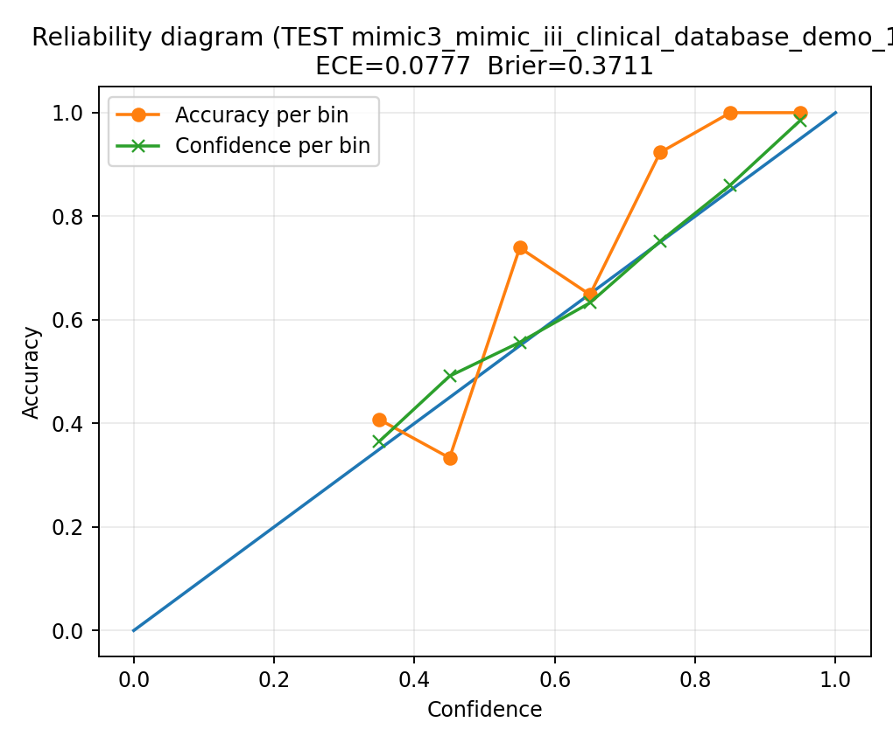

**`mimic3.py`** (ONE FILE, NO pandas, PyTorch-only, auto MIMIC-III/MIMIC-IV demo discovery) and includes your **calibration PNG**.

# penuX — MIMIC-III / MIMIC-IV Pathogen Class Prediction (ONE-FILE, PyTorch, NO-PANDAS)

Research/demo pipeline that trains a **multi-class classifier** to predict a **fixed pathogen class (CAPITAL labels)** from:

- **Microbiology categorical text**
  - `spec_type_desc` (lowercased / whitespace-collapsed)
  - `interpretation` (lowercased / whitespace-collapsed)
- **Antibiotic exposure** (binary one-hot)
  - `vancomycin`, `ciprofloxacin`, `meropenem`, `piperacillin`, `ceftriaxone`
- **Early vitals/labs (required order)**
  - `temperature_c`, `wbc`, `spo2`, `age`

✅ **ONE FILE**  
✅ **NO PANDAS** (CSV streaming)  
✅ **MIMIC-III / MIMIC-IV demo auto-discovery** (+ `.csv.gz` support)  
✅ **PyTorch only** (no TensorFlow)  
✅ **Hybrid model**: Embedding → Conv1D → RNN → BiLSTM + numeric branch → MLP  
✅ **Early stop by target ACC or F1** (default target acc = 0.95)  
✅ **Extra evaluation**: confusion (OvR TP/FP/FN/TN + Sens/Spec/PPV/F1), ROC-AUC/PR-AUC, calibration (ECE/Brier + reliability table), subgroup bias checks

> IMPORTANT: Research/demo only. **Not for clinical use.**

---

## Classes (fixed order, CAPITALS)

```text
B:PSEUDOMONAS AERUGINOSA
B:STAPH AUREUS COAG +
B:SERRATIA MARCESCENS
B:MORGANELLA MORGANII
B:ESCHERICHIA COLI
B:PROTEUS MIRABILIS
B:PROVIDENCIA STUARTII
B:POSITIVE FOR METHICILLIN RESISTANT STAPH AUREUS
B:YEAST
B:GRAM POSITIVE COCCUS(COCCI)
B:OTHER
V:OTHER
````

Mapping is controlled by `map_org()` — if `B:OTHER` dominates, **expand the rules** there.

---

## Data requirements

### MIMIC-III-like root (flat CSVs)

A dataset root containing (case-insensitive, `.csv` or `.csv.gz`):

* `MICROBIOLOGYEVENTS`
* `PRESCRIPTIONS`
* `ADMISSIONS`
* `PATIENTS`
* `D_ITEMS`
* `CHARTEVENTS`
* `D_LABITEMS`
* `LABEVENTS`

### MIMIC-IV-like demo root (folders)

A dataset root with:

* `hosp/`
* `icu/`

And within those folders the equivalent CSVs (the script resolves them automatically).

MIMIC requires credentialed access and is de-identified but still sensitive. See PhysioNet pages for MIMIC-III and the demo dataset.

* MIMIC-III demo v1.4 ([PhysioNet][1])
* MIMIC-III v1.4 ([PhysioNet][2])

---

## Install

Python 3.9+ recommended.

```bash
pip install numpy scikit-learn
pip install torch
pip install matplotlib   # optional (for PNG plots)
pip install scipy        # optional (better p-values in Pearson tests)
```

---

## Run

From repo root:

```bash
python mimic3.py
```

The script will:

1. Discover candidate dataset roots (defaults + `MIMIC_AUTOROOTS`)
2. Resolve MIMIC-III/MIMIC-IV file paths
3. Build labels from `MICROBIOLOGYEVENTS` (`map_org`)
4. Build antibiotic one-hot per `hadm_id`
5. Compute vitals/labs within the first `HOURS_WINDOW` hours from `ADMITTIME`
6. Train the hybrid PyTorch model with early stopping
7. Print metrics + write plots (if matplotlib available)

---

## Auto dataset discovery

The script searches these by default:

* `dataset/mimic` and subfolders
* A bundled/demo-like path (see code)
* Optionally: `MIMIC_AUTOROOTS="/path1,/path2,/path3"`

Example:

```bash
MIMIC_AUTOROOTS="/data/mimic3_demo_1_4,/data/mimic-iv-demo-2.2" \
python mimic_resistance_pipeline_onefile_torch.py
```

---

## Key environment variables (most useful)

### Window / batching

* `HOURS_WINDOW` (default `24`)
* `BATCH_SIZE` (default `64`)

### Stop criteria

* `TARGET_STOP_METRIC` = `acc` or `f1` (default `acc`)
* `TARGET_ACC` (default `0.95`)
* `TARGET_ACC_KIND` = `overall` or `mrsa_mssa`
* `TARGET_F1` (default `0.925`)
* `TARGET_F1_KIND` = `macro` / `weighted` / `mrsa_mssa`
* `MAX_EPOCHS` (default `100000`)
* `EARLY_PATIENCE` (default `360`)
* `MIN_DELTA` (default `1e-7`)
* `RETRAIN_ON_FULL_TRAIN` = `1`/`0` (default `1`)
* `MAX_TRAIN_RESTARTS` (default `5`)

### Loss

* `LOSS_NAME` = `ce` / `wce` / `focal` / `cb_focal` (default `cb_focal`)
* `LOSS_LABEL_SMOOTHING` (default `0.05`)
* `FOCAL_GAMMA` (default `2.0`)
* `CB_BETA` (default `0.9999`)
* `FOCAL_USE_ALPHA` = `1`/`0` (default `1`)
* `MAX_CLASS_WEIGHT` (default `15.0`)
* `BOTHER_EXTRA_DOWNWEIGHT` (default `0.5`)

### Text / sequence

* `MAX_TEXT_TOKENS` (default `20000`)
* `TEXT_SEQ_LEN` (default `64`)
* `EMBED_DIM` (default `96`)
* `CNN_FILTERS` (default `128`)
* `CNN_KERNEL` (default `5`)
* `RNN_UNITS` (default `64`)
* `LSTM_UNITS` (default `64`)
* `MIMIC_ACTIVATIONS` (comma list, e.g. `gelu,swish,elu,relu`)

### Device

* `DEVICE` = `cpu` / `cuda` / empty (auto)

---

## Outputs

### Console

* Label distribution
* Numeric feature order (enforced):

  * `temperature_c, wbc, spo2, age, vancomycin, ciprofloxacin, meropenem, piperacillin, ceftriaxone`
* Overall test accuracy
* Per-class precision/recall/F1
* MRSA vs MSSA subset report
* Confusion matrix + OvR TP/FP/FN/TN + Sens/Spec/PPV/F1
* ROC-AUC / PR-AUC (OvR per-class + macro/weighted)
* Calibration:

  * ECE + Brier + reliability table
* Bias checks (best-effort, if columns exist):

  * gender/sex, age bins, admission_type, admission_location
* Vitals signal:

  * permutation importance (Δloss) + Pearson r,p vs P(bacterial)

### PNGs (if matplotlib installed)

* `calibration__<dataset_tag>__<activation>.png`
* `vitals_feature_signal__<dataset_tag>__<activation>.png`

---

## Example: Calibration plot

If you have this image committed in the branch:





Or using the GitHub file URL:


---

## Troubleshooting

* **“No vitals complete rows”**

  * Increase `HOURS_WINDOW`
  * Confirm `D_ITEMS` has temperature/SpO₂ labels and `D_LABITEMS` has WBC labels
* **Very slow runtime**

  * `CHARTEVENTS`/`LABEVENTS` are huge; this script streams row-by-row (I/O heavy)
  * Use SSD if possible; consider prefiltering by `hadm_id` for experiments
* **Model collapses to B:OTHER**

  * Expand `map_org()` mapping rules (best fix)
  * Tune `BOTHER_EXTRA_DOWNWEIGHT`, `MAX_CLASS_WEIGHT`, and loss settings

---

## Notes / Disclaimer

This code is for **research and educational use only** and must not be used for clinical decision-making.
MIMIC datasets contain sensitive patient information even when de-identified; follow all data-use agreements. ([PhysioNet][1])


## References

### Data sources (PhysioNet)
- MIMIC-III Clinical Database v1.4 (project page + citation/DOI):
  https://physionet.org/content/mimiciii/1.4/
- MIMIC-III Clinical Database Demo v1.4 (open demo subset):
  https://physionet.org/content/mimiciii-demo/1.4/

- MIMIC-IV Clinical Database v2.2 (project page):
  https://physionet.org/content/mimiciv/2.2/
- MIMIC-IV Clinical Database Demo v2.2 (open demo subset):
  https://physionet.org/content/mimic-iv-demo/2.2/

### Community code
- MIT-LCP MIMIC code repository (queries/utilities across MIMIC releases):
  https://github.com/MIT-LCP/mimic-code
