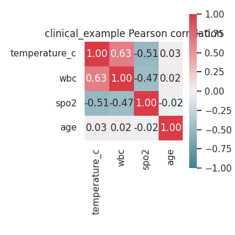
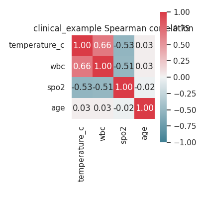

# penuX ✅

Multimodal pipeline and analysis utilities for chest x-ray + clinical data (Normal / Bacterial / Viral). This repository contains data preparation, model training/evaluation, analysis notebooks, and utilities including correlation-matrix generation and per-epoch correlation saving during training.

---

## Table of contents

- [Features](#features)
- [Requirements](#requirements)
- [Quick start](#quick-start)
- [Correlation matrices (new)](#correlation-matrices-new)
  - [Standalone script](#standalone-script)
  - [Notebook example](#notebook-example)
  - [Per-epoch correlation saving during training](#per-epoch-correlation-saving-during-training)
- [Training & evaluation](#training--evaluation)
- [Tests](#tests)
- [Notebooks](#notebooks)
- [Development & contribution](#development--contribution)
- [License](#license)

---

## Features ✨

- End-to-end multimodal (image + clinical) training scripts and examples
- Auto-generation / optional download of synthetic clinical.csv aligned to Kaggle images
- Utilities to compute and save Pearson and Spearman correlation matrices and heatmaps
- Optional per-epoch correlation capture (CSV + heatmap) during training
- Example notebook demonstrating correlation combinations and visualizations
- Unit tests for the correlation tooling

---

## Requirements ⚙️

- Python 3.8+ (the dev container uses Ubuntu 24.04 with Python 3.11)
- Recommended packages: numpy, scipy, pandas, seaborn, matplotlib, scikit-learn, tensorflow (as used by the training scripts)

Install (minimal) via pip:

```bash
python -m pip install -r requirements.txt  # if a requirements file exists
# or install directly
python -m pip install numpy pandas seaborn matplotlib scikit-learn pytest
```

Note: TensorFlow and other heavy deps are only necessary for training and evaluation.

---

## Quick start ▶️

1. Prepare dataset (Kaggle Mooney chest x-ray) and clinical CSV (auto-download or auto-generate):

   - The scripts `model.py`, `model2.py`, `model3.py`, and `m.py` include helpers to prepare or auto-generate clinical data and dataset folders.

2. Compute correlation matrices for a CSV file (see next section) or run training.

---

## Correlation matrices (new) 🔍

### Standalone script

A reusable script computes Pearson and Spearman correlation matrices for numeric columns and saves both CSVs and heatmap PNGs.

Usage:

```bash
python -m scripts.compute_correlations --input clinical.csv --outdir outputs/correlations --prefix clinical
```

Options:
- `--input` / `-i`: input CSV (default: `clinical.csv`)
- `--outdir` / `-o`: output folder (default: `outputs/correlations`)
- `--prefix` / `-p`: filename prefix (default: `clinical`)
- `--columns` / `-c`: comma-separated list of columns to include (default: all numeric columns)

Outputs:
- `<outdir>/<prefix>_pearson.csv` — Pearson correlation coefficients (CSV)
- `<outdir>/<prefix>_spearman.csv` — Spearman correlation coefficients (CSV)
- `<outdir>/<prefix>_pearson.png` — Pearson heatmap (PNG)
- `<outdir>/<prefix>_spearman.png` — Spearman heatmap (PNG)

Tip: Use `--columns temperature_c,wbc,spo2,age` to restrict to specific features.

### Example plots

Here are example heatmaps generated from `clinical.csv` (saved under `docs/images/`):



*Figure: Pearson correlation matrix for the clinical features.*



*Figure: Spearman correlation matrix for the clinical features.*

Grouped-by-pathogen examples (generated from `mimic_features_specpath.csv` or any file with a `label` column and a mapping JSON):

```bash
# Compute per-pathogen correlations and grouped sample heatmap
python -m scripts.compute_correlations --input dataset/mimic/mimic-iii-clinical-database-demo-1.4/mimic_features_specpath.csv --outdir docs/images --prefix mimic_spec --groupby label --compute_per_group --grouped_heatmap --group_map pathogen_vocab.json --sample_limit 200
```

This produces per-group CSVs/PNGs such as `mimic_spec_pearson_Bacterial.csv` and a grouped sample-feature heatmap `mimic_spec_grouped_by_label.png`.

### Notebook example

A short example notebook is available at `notebooks/correlations_example.ipynb` demonstrating programmatic use of the script and inline display of heatmaps.

### Per-epoch correlation saving during training

... (see above for usage; defaults and auto-downsampling rules apply)

### Predicting pathogens from vitals 🧪

You can predict pathogen / class probabilities from clinical vitals using the lightweight `scripts/predict_pathogen.py` utility (no pandas required).

Single prediction example (prints and can save CSV/JSON):

```bash
python -m scripts.predict_pathogen --single --task specpath --temperature_c 37.1 --wbc 7000 --spo2 96 --age 60 --format csv --output pred.csv
```

Batch prediction from CSV (input must include `temperature_c,wbc,spo2,age`):

```bash
python -m scripts.predict_pathogen --input patients.csv --format json --output preds.json --task specpath
```

Examples in the repo:
- `docs/examples/predict_single.csv` — sample single-row input CSV
- `docs/examples/predict_batch.json` — sample batch output (JSON) of predicted probabilities

Notes:
- The script requires trained clinical models `clin_encoder.keras`, `clin_head.keras` and `clin_scaler.npz` to exist in the repo root (these are produced during training).
- For `specpath`, class names are loaded from `pathogen_vocab.json` (generated by the feature-building step).
- Output includes class probability columns; use `--top K` for a top-K summary per row.
- No pandas dependency is required; the script uses stdlib `csv`/`json` for I/O and `numpy`/`tensorflow` for computation.

New convenience parameters (predict_pathogen.py):
- `--threshold FLOAT` — Include only class probabilities >= threshold. For JSON output classes below the threshold are omitted; for CSV they are left empty to preserve columns.
- `--keep_cols COL1,COL2` — Comma-separated list of extra input columns from the CSV to include in the output rows (eg. patient IDs).
- `--sep SEP` — Input CSV delimiter (default: `,`). Use `--sep '\t'` for TSV inputs.
- `--round N` — Round probability values to N decimal places in the output (useful for human-readable reports).
- `--no_print` — Suppress printing to stdout (useful in automation or CI when only file output is required).

Examples:

- Single prediction with threshold & rounding (JSON):

```bash
python -m scripts.predict_pathogen --single --task 3class --temperature_c 36.6 --wbc 7000 --spo2 96 --age 60 --format json --output pred.json --threshold 0.1 --round 2
```

- Batch prediction with extra patient ID kept and TSV input:

```bash
python -m scripts.predict_pathogen --input patients.tsv --sep $'\t' --keep_cols patient_id --format json --output preds.json --round 2
```

Behavior notes:
- `--top K` is applied before `--threshold` (top-K selects the top K classes by probability; threshold then filters low probabilities).
- For CSV outputs, omitted classes (below threshold) are written as empty cells so the table remains consistent.
- `specpath` class names are read from `pathogen_vocab.json` so ensure it is present after feature building or training.

The training pipeline in `m.py` supports saving per-epoch correlation matrices of learned embeddings (image vs. clinical) so you can track how correlations evolve during training.

- CLI flags added to `m.py`:
  - `--corr_every`: Save correlation matrices every N epochs (integer). Set `0` to disable. Default: `1` (every epoch).
  - `--corr_dir`: Output directory for correlation files. Default: `corrs`.

Example (enable per-epoch saving):

```bash
python m.py --task specpath --epochs 20 --steps_per_epoch 200 --corr_every 1 --corr_dir corrs
```

What it saves (per epoch):
- `corrs/<epoch>_pearson.csv`
- `corrs/<epoch>_spearman.csv`
- `corrs/<epoch>_pearson.png`
- `corrs/<epoch>_spearman.png`

Note: for very large runs we auto-adjust the sampling frequency to avoid excessive files. If you leave `--corr_every` at the default (1) and run with `--epochs >= 1000`, the script will automatically set `--corr_every` to `10` and print an informational message. You can always override with `--corr_every <N>`.

You can also call `train_dual(..., corr_every=N, corr_out_dir=Path('corrs'))` from Python when running programmatically.

---

## Training & evaluation 🏃‍♂️

High-level training flow is provided in `model.py`, `model2.py`, `model3.py`, and the dual-correlation training operations are in `m.py` (including `train_dual`). See each file's docstrings and `--help` for CLI options.

Common example:

```bash
# Train using the Mooney dataset (auto-prep if necessary)
python model.py
# or run the dual-correlation training
python m.py --task specpath --epochs 20 --steps_per_epoch 200 --corr_every 1 --corr_dir corrs
```

After training, evaluation artifacts are created (model files, confusion matrix image, AUC printed to console).

### Ordering & batching (new)

Control sample ordering and batch composition during training:

- `--order_by {none,label,group,age}`: Deterministically sort clinical feature rows before the train/val split (useful for reproducible experiments). For example, `--order_by label` sorts samples by their label (Normal, Bacterial, Viral).
- `--stratify_batches`: Enable stratified/balanced batching for the clinical dataset so each batch contains examples proportionally from each class (recommended for imbalanced datasets).
- `--curriculum LABELS`: Comma-separated list to run epoch phases over specific labels in order (e.g., `--curriculum Normal,Bacterial,Viral`). Useful for curriculum learning experiments.

Examples:

```bash
python m.py --task specpath --epochs 50 --order_by label --stratify_batches
python m.py --task binary --epochs 30 --curriculum Bacterial,Viral
```

Implementation notes:
- `--order_by` is applied before shuffling/splitting; tests verify deterministic ordering.
- `--stratify_batches` modifies dataset construction to balance classes per batch and is covered by unit tests.

---

## Tests ✅

Unit tests for correlation utilities are in `tests/test_compute_correlations.py`.

Additional tests and smoke checks:
- `tests/test_predict_pathogen.py` — tests the predict CLI (single and batch modes and new flags).
- `tests/test_compute_correlations_grouped.py` — tests grouped correlation behavior.
- `tests/test_ci_compute_correlations_smoke.py` — a compact CI smoke test that runs `scripts.compute_correlations` on a tiny CSV and verifies that CSV and PNG outputs are created. Run it locally with:

```bash
pytest tests/test_ci_compute_correlations_smoke.py -q
```

CI recommendation: add `.github/workflows/ci-smoke.yml` to run the smoke test on push/PR; I can add this workflow on request.

Run the full test suite with:

```bash
pytest -q
```

---

## Notebooks 📓

- `notebooks/correlations_example.ipynb` — demonstrates computing correlations, showing heatmaps, and programmatic usage of the script.

---

## Development & contribution 👩‍💻

- Use the `tests/` folder and `pytest` to add unit tests for new code.
- Keep code style consistent and add docstrings for public functions.
- If you add dataset download or heavy dependencies, document them in the README and in code comments.

---

## Troubleshooting ⚠️

- Missing clinical models or scaler: `predict_pathogen.py` and `m.py` expect `clin_encoder.keras`, `clin_head.keras`, and `clin_scaler.npz` in the repo root. These are written during training; run training or provide trained model files.
- Missing `pathogen_vocab.json`: for `specpath` task, run the MIMIC feature build (`--rebuild_mimic_features`) to generate the pathogen vocabulary used by the clinical head.
- Missing Python packages (e.g., `seaborn`, `matplotlib`): install required packages listed in the README or use the dev container environment included with this repo.
- Correlation outputs too many files for long runs: see the `--corr_every` auto-downsampling described above.

---

## License

No repository-level LICENSE file is present. If you plan to distribute this code, add a LICENSE (e.g., MIT) and document any dataset license constraints separately.

---

If you want, I can:
- Add example outputs (sample correlation images) under `docs/` or `examples/` ✅
- Add a small CLI example to run correlations as part of CI (smoke test) ✅
- Add a brief troubleshooting section for common issues (missing CSVs, missing packages) ✅

If you'd like any of those, tell me which and I'll add them.